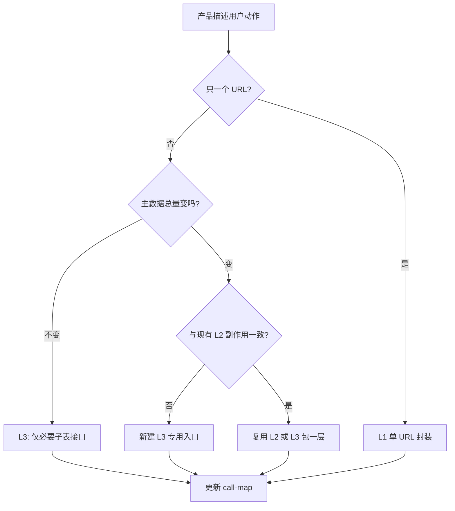

# 前端 API 层：抽象 / 封装 / 复用 — 团队规范

> **适用范围**：各业务仓库的 `services/*Api.ts`、`api/*.ts`、以及封装 HTTP 的 hooks/utils。  
> **目标**：统一「何时封装单 URL、何时做场景函数、何时抽编排」，避免「万能 sync」类副作用。  
> **版本**：1.0 · 可复制到任意项目 `docs/standards/` 使用。

---

## 1. 三个概念（必须先分清）

| 概念 | 定义 | 典型产物 | 允许副作用 |
|------|------|----------|------------|
| **复用（Reuse）** | 同一段**无业务分支**的逻辑多处使用 | 纯函数、响应归一化、参数拼装 | 无（不直接 `request`） |
| **封装（Encapsulate）** | **一个用户/产品动作** → 固定、可列出的 HTTP 调用 | `submitOrder`、`changeBatchCode` | 仅该动作需要的接口 |
| **抽象（Abstract）** | 多种场景共用一个**流程壳** + 配置/开关 | `syncXxxAndYyy(options)` | **所有调用方副作用集合必须一致** |

**团队共识**：

- 你习惯的「**单个 URL 封装**」= 本规范 **L1 原子层**，**必须做**。
- 「**场景封装**」= **L3 入口层**，**一动作一函数**。
- 「**抽象**」= **L2 编排层**，**少做、窄做**；禁止默认当成默认写法。

---

## 2. 分层模型（*Api.ts 推荐结构）

```
┌──────────────────────────────────────────────────────────┐
│ L3 场景入口：一用户动作 = 一个 export，名称为业务语义        │
│     顶部 3～5 行步骤注释；返回 boolean / 明确错误信息        │
├──────────────────────────────────────────────────────────┤
│ L2 场景编排（可选、要少）：固定多步 HTTP，开关 ≤ 2 且互斥    │
│     禁止为单一场景增加第 3 个「模式 flag」                  │
├──────────────────────────────────────────────────────────┤
│ L1 原子封装：一个 URL + method + 入参形状（你习惯的封装）   │
├──────────────────────────────────────────────────────────┤
│ L0 工具：无 request；计算、map、normalize、类型守卫        │
└──────────────────────────────────────────────────────────┘
```

| 层级 | 厚度 | 复用策略 |
|------|------|----------|
| L0 | 薄 | 全局随意复用 |
| L1 | 薄 | 按 URL/资源复用 |
| L2 | 中 | **仅**步骤与副作用完全相同的「一族」场景 |
| L3 | 可厚 | **按动作分裂**，宁可多函数勿多 flag |

---

## 3. 决策表：抽象 / 封装 / 复用？

**新需求或改 bug 前必过此表**（按行从上到下，命中即停）。

### 3.1 主决策表

| # | 问题 | 是 → | 否 → |
|---|------|------|------|
| 1 | 是否只是拼参数、解析 `list/total`、数值计算？ | **L0 复用**（工具函数） | ↓ |
| 2 | 是否只涉及**一个** HTTP 接口，且调用方只需「调接口」？ | **L1 封装**（单 URL） | ↓ |
| 3 | 产品能否用**一句话**描述用户动作（且与现有某函数不同）？ | **新建 L3 场景入口** | ↓ |
| 4 | 是否已有 **≥3 个** L3 入口，且 **HTTP 步骤顺序相同、副作用集合相同**？ | 评估抽 **L2 编排** | 保持多个 L3 |
| 5 | 新场景是否与现有 L2 **副作用不同**（多调/少调某 URL）？ | **禁止**扩展现有 L2；**新建 L3** 或新 L2 | — |

### 3.2 副作用一致性（能否共用一个 L2 / 带 options 的抽象）

| 问题 | 必须全部为「是」才允许共用 L2 |
|------|------------------------------|
| 调用后 **主表/汇总数据** 是否都以同一种方式更新？ | |
| 是否会触发 **可选子流程**（如「补空行」「发消息」「写日志」）？若一方要、一方不要 → **否** | |
| 失败时 UI 是否同一套（刷新哪张表、是否回滚输入）？ | |
| 是否都能用同一公式表达「主数据总量」？ | |

**任一列为否** → 两个 L3，不要共用一个 `sync*`。

### 3.3 单 URL 封装（L1）— 与你现有习惯对齐

| 做法 | 约束 |
|------|------|
| 每个 URL 一个函数（或同一 resource 的 CRUD 一组） | **必须** |
| L1 内不写 `if (业务场景)` 分支 | **必须** |
| L1 不串联第二个 URL | **必须**（串联属于 L2/L3） |
| L1 可接受 `successMessage`、统一 `request` 包装 | **允许** |

---

## 4. 硬性约束（MUST / MUST NOT）

### MUST（必须）

1. **L1**：所有直接 `request`/`axios`/`umiRequest` 的 URL 调用，收敛在 `*Api.ts`（或项目约定的 api 目录），UI/列 render **不得**拼 adjustBatch + PATCH 组合。
2. **L3**：每个用户可见动作对应**具名 export**；函数体开头有 **步骤注释**（`// 1. … 2. …`）。
3. **索引**：模块级维护 **入口表**（5～15 行）：`用户动作 → 函数名 → 调用的 URL → 刷新范围`（可用 markdown，如 `*-api-call-map.md`）。
4. **新 L2**：引入时必须在索引中增加 **§副作用**：会调哪些 URL、**明确不会**调哪些 URL。
5. **Code Review**：涉及 L2/L3 的 PR，审查人勾选 **§6 审查清单**。

### MUST NOT（禁止）

1. **禁止**「凡是改子表都走同一个 `sync*`」— 先过 §3.1。
2. **禁止**在 L2 上为单一场景增加 `if (purpose === '…')` 或第 3 个布尔开关；应新建 L3。
3. **禁止** L0 工具函数内发 HTTP。
4. **禁止** L1 根据 UI 来源（列表/弹框/Tab）走不同副作用路径。
5. **禁止**默认 `rebalance*` / `init*` / `batchSave*` 类「补偿接口」— 仅文档列明的场景可调用。

---

## 5. 抽象「过头」的识别信号（应拆分）

出现 **任意一条** 即视为技术债，优先拆 L3/L2：

1. 调用方需要读长注释才能传对 `options`。
2. 为了新需求给 L2 增加「仅某场景为 true」的 flag。
3. 某路径会调用 **本场景 PRD 未要求** 的接口（线上客诉/网络面板抓包可证）。
4. 文档用「除了 A 场景外……」描述行为。
5. 失败后的刷新/回显策略因调用方不同，却共用同一返回值。

---

## 6. Code Review 清单（可复制到 PR 模板）

```markdown
### API 分层（*Api / services）

- [ ] 新逻辑落在 L0/L1/L3 哪一层？是否符合 §3.1？
- [ ] 是否新增或修改 L2？若是，是否填写副作用表（会调 / 不会调 URL）？
- [ ] 是否存在「只为一个场景」服务的 options？若有，是否应改为独立 L3？
- [ ] UI 是否只调场景入口，未手写多接口串联？
- [ ] 入口索引（call-map / 文件顶注释）是否已更新？
```

---

## 7. 推荐工作流（个人 / 团队）



1. **需求评审**：动作一句话 → 暂定 L3 函数名。  
2. **实现**：先 L1（单 URL）→ 再 L3（步骤注释）→ 第三次重复再考虑 L2。  
3. **联调**：网络面板核对 **不应出现的 URL**。  
4. **合入**：更新 call-map + PR 勾选 §6。

---

## 8. 跨项目落地方式

| 方式 | 说明 |
|------|------|
| **复制本文件** | `docs/standards/api-abstraction-encapsulation-reuse.md` |
| **一页纸速查** | `api-abstraction-encapsulation-reuse-one-pager.md`（中文）/ `…-one-pager-en.md`（英文） |
| **Cursor 规则** | `.cursor/rules/api-layering-decision.mdc`（精简版 + 指向本文件） |
| **业务 call-map** | 各需求目录 `interactions/*-api-call-map.md` 或 `*Api.ts` 顶部索引 |
| **PR 模板** | 粘贴 §6 清单 |

业务特例（如双表 A/B、空批次占位）写在 **项目 call-map**，不写进本通用规范正文。

---

## 9. 附录：命名与文件约定

| 类型 | 命名 | 示例 |
|------|------|------|
| L0 | `build*` / `normalize*` / `calc*` / `get*FromRecord` | `normalizeListResponse` |
| L1 | 动词 + 资源 | `adjustBatchRecord`, `fetchOrderById` |
| L2 | `sync*` / `orchestrate*`（慎用） | `syncBatchAndSummary` |
| L3 | 场景 + 视图/对象 | `changeBatchViewLineBatchCode` |

- 一个业务域一个 `*Api.ts` 为主真源；超过 ~800 行按域拆分，**不**按「sync / fetch」拆。

---

## 10. 变更记录

| 日期 | 版本 | 说明 |
|------|------|------|
| 2026-05-28 | 1.0 | 初版：L0–L3、决策表、MUST/NOT、CR 清单 |
