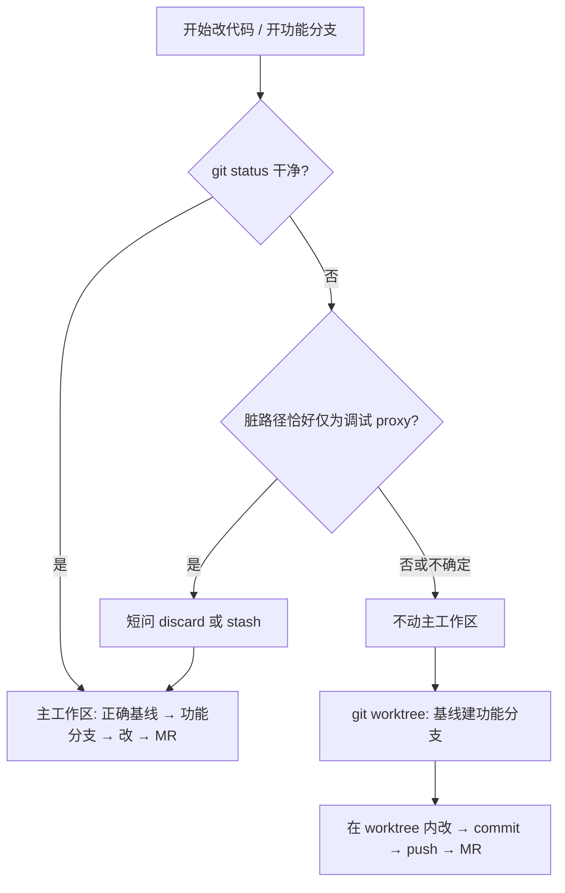

# 脏工作区与 git worktree

配套 Agent 短规则：`guidelines/dirty-workspace-worktree.md`。

## 背景

主工作区常会留下未提交改动，来源未必是「当前需求」：

- 另一个 Agent / 并行会话正在改
- 上次改完忘了 commit
- 仅本地调试用的 proxy / 环境开关（公司前端常见：`config/proxy.ts`）

若一律 `stash` 或 discard，可能弄丢别人的半成品，或把调试改动和业务改动搅在一起。若一律在脏目录上硬切分支，又可能把无关 diff 带到错误分支。

**例外（所见即所得）**：脏路径集合**恰好**是调试 proxy 时，默认 discard/stash 后继续在主工作区做，**不要**为此开 worktree。

## 决策



「恰好仅为调试 proxy」判定：未提交文件集合是 `config/proxy.ts`（或同仓约定的仅代理配置路径），**不含**其它业务文件。混合脏 → 走 worktree。

## 示例

| 场景 | 做法 |
|---|---|
| `git status` 干净，工单 IKFMUZ 铁血现场 | `git fetch` → 从 `origin/release-tx` 开 `feature/release-tx-…-IKFMUZ-…`，在主工作区改 |
| 仅 `M config/proxy.ts`（本地代理指向） | 短问 discard vs stash → 处理后按上条；**不开** worktree |
| 主工作区有未提交业务 diff，又要开新铁血单 | 留着主工作区不动；`.worktrees/…` 从 `origin/release-tx` 开新分支做新单 |
| `proxy.ts` + 其它业务文件一起脏 | 按「其它脏」→ worktree；勿把业务半成品当 proxy 扔掉 |
| 看不清未提交是什么 | 问用户；问之前默认 worktree |

## MUST / MUST NOT

| MUST | MUST NOT |
|---|---|
| 动手前看 `git status` | 对非「仅 proxy」脏文件擅自 stash / discard |
| 仅 proxy 路径脏 → discard/stash 后主区继续 | 仅为 `config/proxy.ts` 脏时开 worktree |
| 脏且非仅 proxy → worktree | 默认从 `master`/`main` 开铁血单 |
| worktree 功能分支基于正确产品线基线 | 在主工作区硬切分支「带走」未确认归属的改动 |
| MR target = 该基线 | 为干净工作区无故套 worktree |
| 合入后、worktree 干净且无未推送提交 → `worktree remove` | 在有未提交改动 / 未推送 commit 时删 worktree |

## 清理条件（磁盘）

同时满足即可删附属 worktree：

1. 已合进目标基线（或确认不再需要该 checkout）
2. worktree 内无未提交改动
3. 无未推送提交（相对 upstream ahead=0，或提交已在远端/基线）

### 何时去检查（触发）

事件驱动，不靠每日定时硬删：

| 触发 | Agent / 人 |
|---|---|
| 用户确认 MR 已合入 / finishing 该分支 | **立刻**检查对应 worktree，满足条件则 `remove` |
| 准备 `git worktree add` 开新目录前 | 先扫现有 list，可清的先清再建 |

```bash
git worktree list
# 对每个附属路径：干净？ ahead=0？已在基线？ → remove
git worktree prune
```

## 与其它规范的关系

- 合代码、连续 commit 文案：`guidelines/git-commit-mr.md`
- Superpowers `using-git-worktrees`：隔离目录创建细节可参照；**是否**开 worktree 以本决策表为准
- kb 工作流镜像：`~/Mycodes/kb/domains/workflow/dirty-workspace-worktree.md`（与 `company-git-branch` 拼接）
